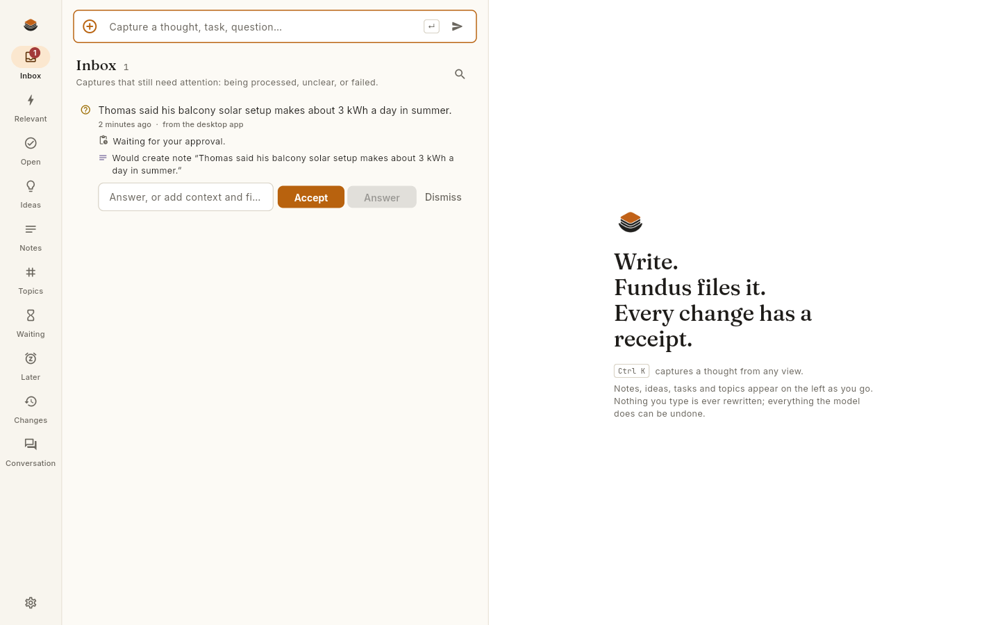
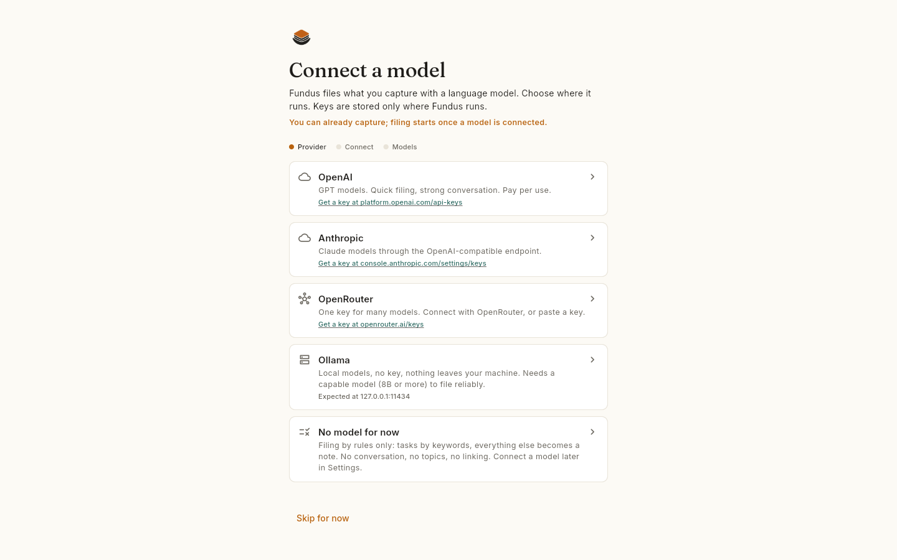
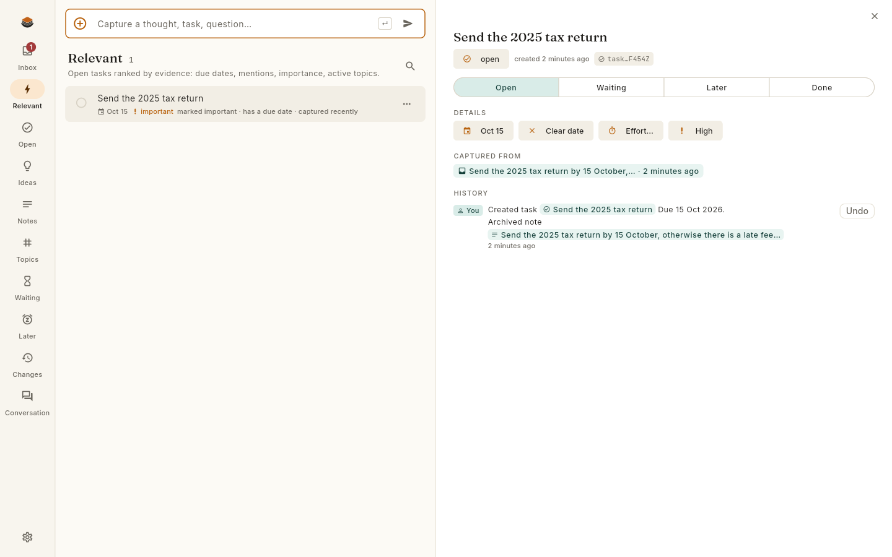
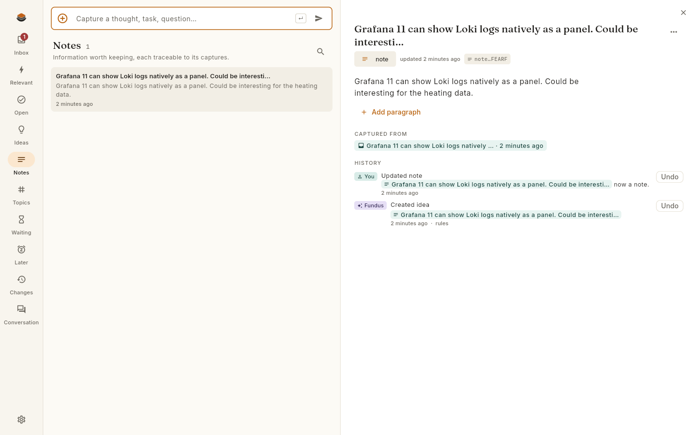
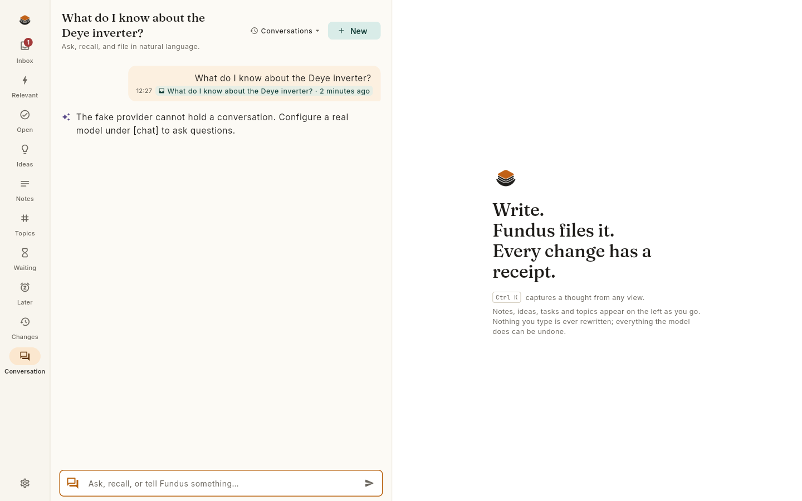
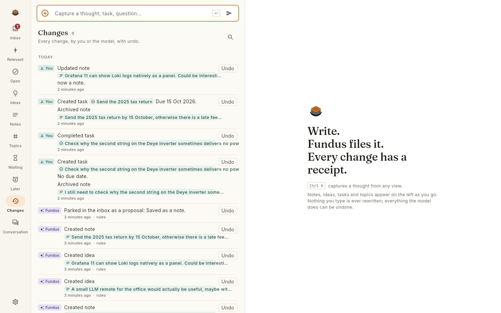

<p align="center"></p>

<p align="center"><strong>Write down what is on your mind. Fundus sorts it into notes, ideas and tasks, remembers where everything came from, and answers your questions about it.</strong></p>

<p align="center">Runs on your own computer. Your data stays in files you own. Every change is explained and can be undone.</p>

---

## What it does

You type a thought, in whatever words come to mind:

> *I still need to check why the second string on the Deye inverter sometimes delivers no power.*

Fundus files it for you. A moment later a small receipt appears:

> Created task “Check why the Deye's second string sometimes delivers no power”. No due date. Linked to Solar.

That is the whole idea. No folders to choose, no tags to maintain, no forms to fill in. You capture; a language model of your choice does the filing; Fundus keeps the books.

- **Capture anything** in a text box, from a global shortcut, on the command line, or in a conversation. What you write stays exactly as you wrote it, forever.
- **Find it again** by asking in plain language: *What were my thoughts on a Grafana dashboard for the heating data? Which open tasks belong to the solar system? What could I finish in an hour?* Fundus answers from your own notes and cites them.
- **Let the model organise**: notes and ideas get titles and topics, tasks get recognised, repeated mentions raise a task's attention, questions you asked get answered from your own notes.
- **Stay in control**: every automatic change shows a receipt of what actually happened, with an Undo button. Nothing is deleted or rewritten behind your back; the model may only add, never overwrite or remove.
- **Own your data**: a plain event log and JSON on your disk, Markdown export any time, no account, no cloud, works with OpenAI, Anthropic, OpenRouter or a local Ollama model.

<p align="center"></p>

## Start in one minute

1. Download the app for your system from the [releases](../../releases) page (the [edge](../../releases/tag/edge) pre-release is the newest build of `main`):
   **Linux** `Fundus-<version>-x86_64.AppImage` (make it executable and run it),
   **macOS** `Fundus-<version>-macos.zip` (unzip, drag to Applications; the first start needs a right-click → Open because the app is not yet notarised),
   **Windows** `Fundus-<version>-windows.zip` (unzip anywhere and start `fundus_app.exe`; SmartScreen will ask once because the build is unsigned).
   The app carries its own background service; nothing else to install.
2. Open it. The first screen offers OpenAI or Anthropic (paste an API key), OpenRouter (connect with one click), a local Ollama, or "no model for now". Fundus tests the connection and suggests two models: a fast one for filing, a capable one for conversations.
3. Write something. That is all.

You can capture before a model is connected; those captures wait in the inbox and get filed as soon as one is.

<p align="center"></p>

**Other ways to run it.** The single binary `fundus` (same releases page) runs the service and opens the same interface in your browser, for servers, headless machines or a quick look: `./fundus`. A Docker image with that interface is in `deploy/`. A tiny quick-capture window for a global shortcut is described in [app/README.md](app/README.md).

## A tour

| | |
|---|---|
| **Inbox** | Captures that still need you: being filed, parked with a question, waiting for your approval. |
| **Relevant** | Open tasks ordered by evidence: due dates, repeated mentions, importance, active topics. The ordering explains itself. |
| **Ideas, Notes, Topics** | What the model built from your captures. Every paragraph shows which capture it came from. |
| **Conversation** | Ask, and get answers with citations into your own notes. Tell it something new and it files it, with a receipt. |
| **Changes** | The audit log. Who changed what, when, and Undo. |
| **Inspector** | Read and edit any item directly. This is the escape hatch: you always keep direct control over your data. |

<p align="center"></p>
<p align="center"></p>
<p align="center"></p>
<p align="center"></p>

## What Fundus is not

It is not another note app you have to organise yourself, not a to-do system that demands daily reviews, not a chatbot with an unreliable memory, and not a general agent with access to your computer. It manages knowledge, ideas and tasks. That is all, on purpose.

## Status

Pre-alpha, built for personal use first. The core (capture, filing, conversation, views, undo, export) works end to end on Linux desktop and in the browser. Research with web sources, voice input, mobile apps and semantic search are planned. See [docs/concept.md](docs/concept.md) for the full concept and the changelog.

---

## For developers

**Build**

```
make build        # bin/fundus (static Go binary; embeds the web UI if app/build/web was built)
make ui           # Flutter web build → embedded into the next make build
make ui-linux     # native Linux desktop app (app/build/linux/x64/release/bundle)
make appimage     # Linux desktop app + daemon as dist/Fundus-<version>-x86_64.AppImage
make test         # Go tests; make app-test runs flutter analyze and flutter test
```

GitHub Actions builds all of it on every push (`.github/workflows/ci.yml`): tests, fuzzing, the web UI, the Go binaries for five platforms, the desktop end-to-end test and the Docker image. On `main` and on tags (`release.yml`) it also builds the desktop apps for Linux, macOS and Windows with the daemon bundled inside and pushes the image to GHCR: every push to `main` refreshes the rolling `edge` pre-release and the `:edge` image, a version tag (`v1.2.3` or `1.2.3`) publishes a GitHub release with every artifact and the `:latest` image. No secrets to configure: the automatic `GITHUB_TOKEN` is enough.

Requirements: Go 1.27, Flutter stable (for the UI), ImageMagick for icons. Without Flutter you still get a working daemon and CLI; the binary serves a placeholder page.

**How it works**

```
   capture ─► inbox ─► triage (LLM, single shot, JSON schema) ─► typed operations
                                                                     │
   conversation ─► tool loop (search, get, list, apply, undo) ───────┤
                                                                     ▼
                        core: validate → append to event log → apply → receipt
                                   │                               │
                            JSONL segments (hash chain)      views, search, undo
```

The model never touches storage. It proposes typed operations; the core validates them, appends them to an append-only event log, and only then updates the in-memory state and answers with a receipt of what was really written. Model actors are restricted in the core itself: they can create, append, link and complete, but not reword, delete, rename, archive or force an undo.

**Read next**

- [docs/concept.md](docs/concept.md), the product concept and changelog
- [docs/api.md](docs/api.md), the HTTP API (commands, queries, events)
- [docs/data-model.md](docs/data-model.md), objects, provenance, event log format
- [docs/decisions/](docs/decisions/), the architecture decision records (ADR-0001 to ADR-0013)
- [CONTRIBUTING.md](CONTRIBUTING.md), how to add an operation or a provider
- [design/README.md](design/README.md), logo and palette

**CLI cheat sheet**

```
fundus                          start and open the UI
fundus capture "…" [--wait]     capture (waits for the receipt with --wait)
fundus inbox | relevant | open  views; also ideas, notes, topics, waiting, later, done
fundus ask "…"                  conversation
fundus show ID | search QUERY
fundus done TASK_ID | later TASK_ID | reopen TASK_ID
fundus accept CAPTURE_ID        apply a parked proposal
fundus changes | undo TXN_ID
fundus export --format markdown --out kb.zip
fundus backup --out backup.zip  consistent copy of the event log
fundus verify                   replay the whole log offline and compare with the snapshot
```

**Security model in one paragraph**

The daemon serves one user. On loopback it needs no token; on any other address it refuses to start without one. Every request must carry a loopback or configured Host, must not come from another web origin, and must send JSON, so a page open in your browser cannot read or write your notes. Keys are stored in a file only you can read and are never returned by the API; a stored key never follows a changed endpoint. Details in [docs/api.md](docs/api.md) and [ADR-0005](docs/decisions/ADR-0005-autonomy-policy.md).

## License

Copyright © 2026 the Fundus authors. AGPL-3.0. Fundus is free software; if you run a modified version as a service, you must share your changes.
